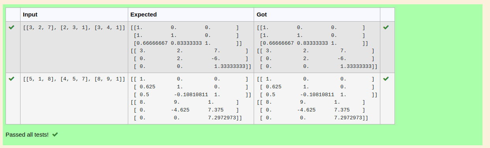
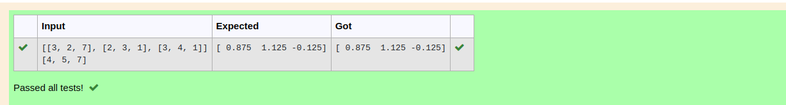

# LU Decomposition 

## AIM:
To write a program to find the LU Decomposition of a matrix.

## Equipments Required:
1. Hardware – PCs
2. Anaconda – Python 3.7 Installation / Moodle-Code Runner

## Algorithm
1. 
2. 
3. 
4. 

## Program:
'''Program to find L and U matrix using LU decomposition.
Developed by: baskaran
RegisterNumber: 22008800
import numpy as np   #from numpy import array
from scipy.linalg import lu
arr=eval(input())
a=np.array(arr)
p,l,u=lu(a)
print(l)
print(u)
```
(ii) To find the LU Decomposition of a matrix
```
/*
Program to find the LU Decomposition of a matrix.
Developed by: 22008800
RegisterNumber: 22008800
*/
import numpy as np
from scipy.linalg import lu_factor,lu_solve
a=np.array(eval(input()))
b=eval(input())
res=lu_factor(a)
sol=lu_solve(res,b)
print(sol)


## Output:



## Result:
Thus the program to find the LU Decomposition of a matrix is written and verified using python programming.

